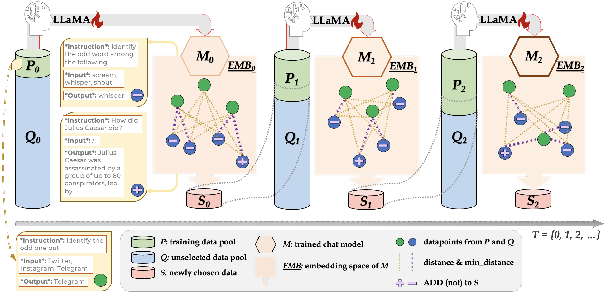

# DiverseEvol: Self-Evolved Diverse Data Sampling for Efficient Instruction Tuning

<p align="center">
📖 <a href="https://arxiv.org/abs/2311.08182" target="_blank">Paper</a>  <br>
</p>

We introduce **DiverseEvol**, an efficient instruction-tuning method that allows the model itself to iteratively sample training subsets to improve its own performance, without any external supervision from humans or more advanced LLMs. Central to our data selection technique is the maintenance of high diversity in the chosen subsets, as the model selects new data points most distinct from any existing ones according to its current embedding space. In experiments across three datasets and benchmarks, our models, trained on less than 8\% of the original dataset, maintain or improve performance compared with finetuning on full data. 

Below shows the overall workflow of **DiverseEvol**:
<p align="center">

</p>

## Getting Started

### Prerequisites

Make sure you have the following prerequisites installed:

- Python >= 3.10
- PyTorch >= 2.0
- Cuda >= 11.7
- Transformers >= 4.28.1
- Vendi_Score: https://github.com/vertaix/Vendi-Score

### Environment

Or create a Conda environment and activate it with the provided ``environment.yml`` file:

```bash
conda env create -f environment.yml
source activate diverse_evol
```

## Running DiverseEvol

All configurations are stored in ``.yml`` files. We provide two example configs:

- `configs/config_debug.yml`: for debugging on a small dataset.
- `configs/config_example_kc_dolly.yml`: for running KCenter-based DiverseEvol on the Databricks-Dolly dataset.

You can customize these configurations to suit your experiment needs. Key configurations to consider include:

- `full_data_path`: Path to the source dataset.
- `model_name_or_path`: Path to the foundation LLM weights and tokenizers.
- `evol_schedule_name`: The sampling method to apply, e.g., "KCenterSampling."
- `result_dir_name`: A name identifier for each DiverseEvol run. We use this to create folder storing all the resulting data subsets and finetuned models.
- `init_label_num`: The number of samples randomly selected to train the initial model (rd_0).
- `n_round`: The number of iterations to run.
- `n_query`: The number of new data points to add to the next round's training.

To start an experiment, use the following command, specifying your configuration file and wandb key:

```bash
CUDA_VISIBLE_DEVICES=0,1,2,3 nohup python -m torch.distributed.run --nproc_per_node=4 train.py --config_file {YOUR-CONFIG-FILE} --wandb_key {YOUR-WANDB-KEY} > {YOUR-LOG-FILE} 2>&1 &
```

Your experiment results will be saved in the following format:

```
evol_res
└── {YOUR-RESULT-DIR-NAME}
    ├── data  # training data pool and unselected data pool for each iteration
    │   ├── rd_0_labeled.json 
    │   ├── rd_0_unlabeled.json
    │   ├── rd_1_labeled.json
    │   ├── rd_1_unlabeled.json
    │   ├── ...
    │   ├── rd_N_labeled.json
    │   └── rd_N_unlabeled.json
    └── output  # instruction-tuned chat model for each iteration
        ├── rd_0
        ├── rd_1
        ├── ...
        └── rd_N 
```

## Generating Answers 

With models trained in each iteration, you can generate responses to questions in different test sets and customize the range of iterations to consider.

To generate answers, use the following command:

```bash
nohup python eval.py --eval_stage generate_answer --device {GPU-IDX} --schedule {YOUR-RESULT-DIR-NAME} --rd_start 0 --rd_end 10 --testsets vicuna koala wizarlm > {YOUR-LOG-FILE} 2>&1 &
```

This command will create a folder structure for the generated answers in the following format:

```
evol_answer
├── koala_test
│   └── {YOUR-RESULT-DIR-NAME}
│       ├── rd_0.jsonl  
│       ├── rd_1.jsonl
│       ├── ...
│       └── rd_N.jsonl  # koala_bench answers generated by chat model trained in iteration/round N
├── vicuna_test
│   └── {YOUR-RESULT-DIR-NAME}
│       ├── rd_0.jsonl
│       ├── rd_1.jsonl
│       ├── ...
│       └── rd_N.jsonl
└── wizardlm_test
    └── {YOUR-RESULT-DIR-NAME}
        ├── rd_0.jsonl
        ├── rd_1.jsonl
        ├── ...
        └── rd_N.jsonl
```

Feel free to customize the test sets (`--testsets`) and iteration range (`--rd_start` & `--rd_end`) to suit your specific analysis needs.

Additionally, we provide all the answers generated by our trained models in `evol_answer_reference/`, which directly leads to our reported results. We also include the answers by ChatGPT (GPT-3.5-TURBO) that serves as a general competitor in our paper.


## GPT4-Judge

After generating the answers to testsets, you can compare them using GPT4. Refer to our `GPT4_JUDGE_TEMPLATE` in `consts.py` or Appendix A in our paper.

In `evol_gpt4_judge_reference/`, you can find the GPT4-judge responses to all the comparisons reported in our paper.


## Analyzing Dataset Diversity 

You can also evaluate the selected data subsets in terms of diversity (measured by Vendi-Score) using the following command:

```bash
nohup python eval.py --eval_stage analyse_diversity --device {GPU-IDX} --schedule {YOUR-RESULT-DIR-NAME} --embed_model_path {PATH-TO-THE-MODEL-USED-FOR-EMBEDDING} --rd_start 0 --rd_end 10 > {YOUR-LOG-FILE} 2>&1 &
```

This command will provide vendi-scores of each round's training data directly in the output. Additionally, it should result in a `.pkl` file that stores the reported diversity results:

```
evol_diversity
└── {YOUR-RESULT-DIR-NAME}_RD={rd_start}-{rd_end}_MEASURES=vendi.pkl
```

You can also adjust the iteration range (`--rd_start` & `--rd_end`).


## Acknowledgement
Our implementation is largely inspired by the following codebases:
* [stanford_alpaca](https://github.com/tatsu-lab/stanford_alpaca): A repository that shares the finetuning scripts of instruction-following LLaMA models.
* [DeepAL](https://github.com/ej0cl6/deep-active-learning): A toolbox for various data sampling logics.


## Citation

If you find our paper and code useful in your research, please consider giving us a star ⭐ and citing us 📝: 

```BibTeX
@misc{wu2023selfevolved,
      title={Self-Evolved Diverse Data Sampling for Efficient Instruction Tuning}, 
      author={Shengguang Wu and Keming Lu and Benfeng Xu and Junyang Lin and Qi Su and Chang Zhou},
      year={2023},
      eprint={2311.08182},
      archivePrefix={arXiv},
      primaryClass={cs.CL}
}
```


---
If you have any questions or need further assistance, please don't hesitate to reach out: `wushengguang.wsg@alibaba-inc.com` or `lukeming.lkm@alibaba-inc.com`.

Happy experimenting with **DiverseEvol** ^_^
